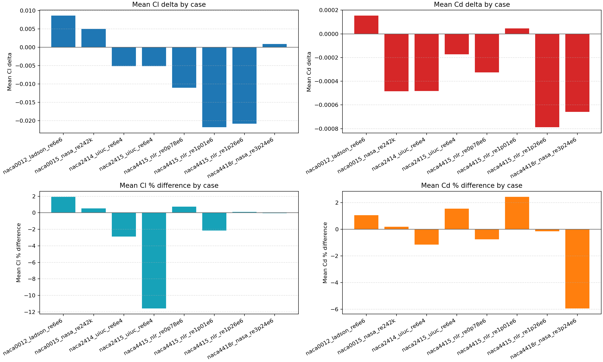

# Airfoil Tools

[](https://github.com/giuliodori/airfoil-tools/releases/latest)
[](https://github.com/giuliodori/airfoil-tools/actions)

Airfoil Tools is a desktop GUI to generate 4-digit NACA profiles, a classic aerodynamic family used in wings, hydrofoils, and lifting surfaces.
Fast export to `.pts`, `.csv`, `.dxf`, and `.stl` (with span-based extrusion for STL), plus a quick estimate of `lift` and `drag` in a few steps.


Download the latest release exe:

```text
https://github.com/giuliodori/airfoil-tools/releases/latest
```


## Why it is useful

When you need a 4-digit NACA profile ready for CAD or simulation, starting from scratch takes time and the tools are not immediate.

Between calculations, formats, and different tools, the path from idea to a usable profile slows the project and adds friction.

Airfoil Tools keeps it all in one GUI: generate the profile, export to `.pts`, `.csv`, `.dxf`, or `.stl`, and get a quick `lift` and `drag` estimate (not CFD).
You can work in classic flat mode or in curved mode (radius-based) for bent sections.
Benchmark validation against NASA, UIUC, and NLR/OSU reference data shows good agreement on the best-supported cases, with mean `Cl` differences around `0.3%` to `5%` and mean `Cd` differences around `6%` to `9%`. Harder low-Reynolds cases can still reach about `20%` mean `Cl` difference.

## What you get right away

- Instant generation of 4-digit NACA profiles
- Quick export to `.pts`, `.csv`, `.dxf`, and `.stl` (solid from profile + span)
- Flat profile and curved profile (radius) modes in the same GUI
- `lift` and `drag` estimates in the same flow


## Easy install (exe recommended)

For most users, the executable is enough.

### 1) Download

Download the exe from the latest release.

If you cloned the repository source, note that `dist/airfoil-tools.exe` is a build artifact and may be absent until you create a release build.

### 2) Run

- Double-click the executable downloaded from the latest release page.
- The GUI opens and you can generate and export profiles immediately.


## Python source (optional)

Use this section only if you want to run from source.

### Requirements (source only)

- Python 3.10+
- `numpy`
- `matplotlib`
- `ezdxf` (required for `.dxf` export)

Install dependencies:

```bash
python -m pip install -r requirements.txt
```

Auto-install: if `numpy` or `matplotlib` are missing, the app will prompt you at launch.
If `ezdxf` is missing, the app will prompt you when saving `.dxf`.

Run:

```bash
python airfoil_tools.py
```

On Windows you can also use:
- `airfoil-tools.bat`

## CLI (advanced / optional)

The GUI remains the primary workflow.

If you are a power user and want terminal commands, see the dedicated CLI guide:

- [`CLI.md`](CLI.md)

## Benchmark snapshot

The aerodynamic estimate is checked against a small benchmark suite built from UIUC, NASA, and NLR/OSU reference data.
The chart below is generated by `benchmarks/compare_cli_vs_reference.py` and gives a quick view of absolute and percentage error by case.



## CAD examples for `.pts`, `.csv` and `.dxf`

### CAD/3D with DXF support

- AutoCAD
- CREO Parametric
- Fusion 360
- Inventor
- SolidWorks
- FreeCAD
- Rhino
- BricsCAD
- DraftSight
- QCAD
- LibreCAD
- Onshape (DXF workflow)

### Point cloud / `.pts` (XYZ) tools

- CloudCompare
- MeshLab
- MATLAB
- GNU Octave
- Python (NumPy / Pandas)
- CATIA (point import)
- Siemens NX (point import)
- Autodesk Alias (point set)

> Tip: `.pts` and `.csv` exports can be written as `xy` or `xyz` columns (default: `xyz`).

## A short history of NACA profiles: the "LEGO" of aerodynamics

If you are designing a wing to lift an aircraft, a hydrofoil, or a racing car wing, you will eventually run into four key letters: `NACA`.

In the late 1920s and early 1930s, the National Advisory Committee for Aeronautics introduced a simple, powerful system: describe profile shapes with a numeric code. This brought order to a field driven by trial and error and made profiles comparable and reusable.

The 4-digit series is still widely used for preliminary design and prototypes. For example, `NACA 2412` means 2% max camber at 40% of the chord and 12% thickness.

Over time, more advanced families appeared (laminar series and supercritical profiles) to reduce drag at higher speeds. Classic NACA profiles remain a practical reference for wings, hydrofoils, control surfaces, and low-drag cooling ducts.

They are useful for designers and makers because they:

- come with decades of experimental data
- are easy to describe, generate, and compare
- let you start from a known geometry before CFD or advanced testing

`airfoil-tools` exists for this reason: take a known geometry and make it immediately usable, with `.pts`/`.dxf` export and a quick `lift` and `drag` estimate.

## Notes on 4-digit NACA profiles

4-digit NACA profiles are a historic family described by four numbers that encode geometry in a simple, repeatable way. They remain a solid reference for preliminary design, education, and quick comparisons.

### Digit meaning

The four digits are `M P TT`:

- `M` (first digit) is maximum camber as a percentage of chord.
- `P` (second digit) is the position of max camber in tenths of chord.
- `TT` (last two digits) is maximum thickness as a percentage of chord.

Example:

`NACA 2412` means 2% max camber at 40% chord, 12% thickness.

### How to read them quickly and where they are used

Symmetric profiles (zero camber) for applications where you need symmetric behavior:

- `NACA 0012` and `NACA 0015` for tail surfaces, rudders, and general profiles.

Profiles with moderate camber for wings and small aircraft:

- `NACA 2412` and `NACA 4412` for light wings and general applications needing good lift.

Thicker profiles for structural robustness or lower Reynolds numbers:

- `NACA 0018` and `NACA 4418` for structures with thickness constraints or lower Reynolds.

## License

This project is released under a dual license:

- GNU General Public License v3.0 (GPL-3.0-only) for open-source use
- Commercial license for proprietary or closed-source use

For commercial licensing requests and specific terms, write to:
- info@duilio.cc
